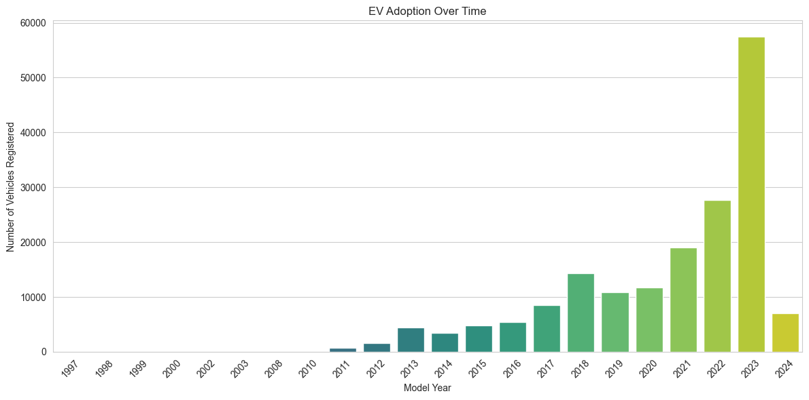
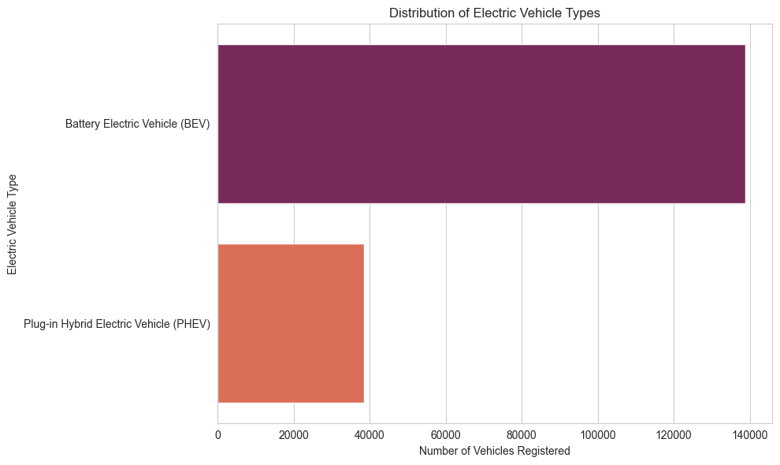
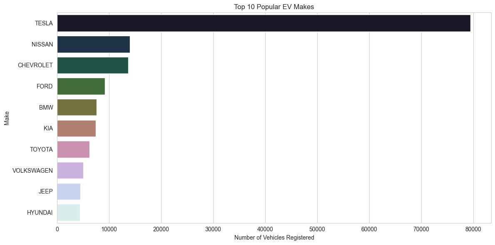
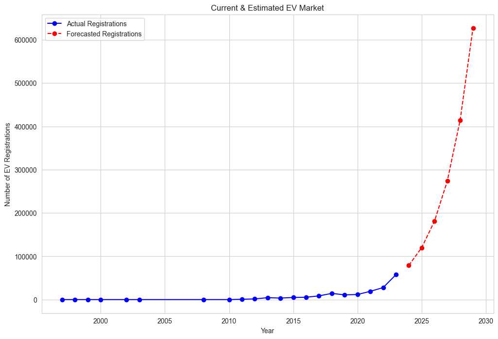

<<<<<<< HEAD
=======
# Electric Car Analysis 🚗⚡

Exploratory analysis and growth forecasting of Washington State's official electric vehicle registry — 177,000+ vehicles, cleaned, visualized, and projected out to 2029.


[](LICENSE)
[](https://colab.research.google.com/github/kianmmoeini/Electric-Car-Analysis/blob/main/notebooks/electric_veh_analysis.ipynb)

## Overview

This project explores the [Washington State Department of Licensing's Electric Vehicle Population Data](https://data.wa.gov/Transportation/Electric-Vehicle-Population-Data/f6w7-q2d2/about_data) — the official registry of every Battery Electric Vehicle (BEV) and Plug-in Hybrid Electric Vehicle (PHEV) registered in the state. Using Python, the analysis cleans the raw registry data, explores adoption trends across manufacturers and counties, and fits a growth model to project registrations through 2029.

## ✨ Key Findings

**Adoption is accelerating fast.** Registrations grew from a single vehicle in 1997 to over 57,500 new registrations in 2023 alone — almost double the *combined* total for 2011 through 2017. (2024's lower count reflects a partial year in the source data, not a slowdown.)



**Battery-electric vehicles dominate.** 78.3% of registered vehicles are fully electric (BEV) versus 21.7% plug-in hybrids (PHEV) — a roughly 4-to-1 split in favor of full electrification.



**Tesla and King County anchor the market.** Tesla alone accounts for 44.8% of every registered EV in the state (79,471 vehicles) — more than the next nine manufacturers combined. Geographically, King County (Seattle metro) holds 52.3% of all registrations.



**Reported range averages ~122 miles, with a data quirk worth noting.** Among vehicles with a reported EPA range, the average is 121.8 miles (max 337). However, 51.7% of records list a range of 0 — this reflects incomplete reporting for those vehicles (common for older or lower-volume listings), not a fleet of zero-range cars.

**The growth curve, extrapolated, is steep.** Fitting an exponential curve to actual 2011–2023 registrations and projecting forward suggests annual new registrations could climb from ~79,000 in 2024 to ~627,000 by 2029. This is a simple curve fit, not an econometric model — it doesn't account for market saturation, incentive changes, or supply constraints, so treat it as a directional trend rather than a hard prediction.



## Dataset

| Column(s) | Description |
|---|---|
| `Make`, `Model`, `Model Year` | Vehicle identity |
| `Electric Vehicle Type` | Battery Electric (BEV) or Plug-in Hybrid (PHEV) |
| `Electric Range` | EPA-rated range in miles (often unreported — see note above) |
| `Base MSRP` | Manufacturer's suggested retail price |
| `CAFV Eligibility` | Clean Alternative Fuel Vehicle incentive eligibility |
| `County`, `City`, `Postal Code`, `Legislative District` | Registration location within Washington |
| `Electric Utility` | Utility provider(s) serving that location |
| `Vehicle Location` | Latitude/longitude point |

**Size:** 177,866 records × 17 columns (177,473 after dropping rows with missing location data) · **Coverage:** 40 manufacturers, 139 models, 39 WA counties.

## Tech Stack

- **Python 3** — core language
- **Pandas / NumPy** — data cleaning and manipulation
- **Matplotlib / Seaborn** — visualization
- **SciPy** (`curve_fit`) — exponential growth modeling
- **Jupyter Notebook** — analysis environment

## Project Structure

```
Electric-Car-Analysis/
├── data/
│   └── Electric_Vehicle_Population_Data.csv
├── notebooks/
│   └── electric_veh_analysis.ipynb
├── images/
│   ├── ev_adoption_over_time.png
│   ├── ev_type_distribution.png
│   ├── top_10_ev_makes.png
│   └── ev_registration_forecast.png
├── requirements.txt
├── LICENSE
└── README.md
```

## Getting Started

Clone the repository and enter the project directory:

```bash
git clone https://github.com/kianmmoeini/Electric-Car-Analysis.git
<<<<<<< HEAD
cd Electric-Car-Analysis
```

Install dependencies (a virtual environment is recommended):

```bash
python -m venv venv
source venv/bin/activate  # on Windows: venv\Scripts\activate
pip install -r requirements.txt
```

Launch the notebook:

```bash
jupyter notebook notebooks/electric_veh_analysis.ipynb
```

Or skip local setup entirely and run it in the cloud via the **Open in Colab** badge above.

## Analysis Process

The notebook follows this workflow:

1. Load the registry CSV and inspect its structure
2. Clean the data (handle missing values)
3. Explore adoption trends by model year, county, and city
4. Compare vehicle types, manufacturers, and models
5. Examine the distribution of electric range
6. Fit an exponential growth curve and project registrations through 2029

## Future Improvements

- [ ] Add an interactive dashboard (e.g. Plotly Dash or Streamlit)
- [ ] Apply machine learning models to predict range or price from vehicle features
- [ ] Bring in additional state or national EV datasets for comparison
- [ ] Add markdown commentary directly in the notebook to walk readers through each step

## License

This project is licensed under the [MIT License](LICENSE).

## Author

**Kian Moeini**
[GitHub](https://github.com/kianmmoeini) · [Portfolio](https://kianmoeini-portfolio-peach-mu.vercel.app/)
=======
```
## Navigate to the project directory:
```bash
cd Electric-Car-Analysis
```
## Install required libraries:
```bash
pip install -r requirements.txt
```
# Usage

## Run Jupyter Notebook:
```bash
jupyter notebook
```
 Open the analysis notebook and explore the data analysis process and visualizations.

## Analysis Process

# The project workflow includes:

## Loading the dataset
## Data cleaning and preprocessing
## Exploratory Data Analysis
## Data visualization
## Finding patterns and insights
# Results

The analysis provides insights into electric vehicle characteristics and helps understand relationships between different EV features using visualizations and statistical methods.

## Future Improvements
### Add interactive dashboards
### Apply machine learning models for prediction
### Include more electric vehicle datasets
### Improve visualization and reporting
# Author

## Kian Moeini

## GitHub:
https://github.com/kianmmoeini
### porfolio website:
https://kianmoeini-portfolio-peach-mu.vercel.app/
>>>>>>> 075360996ccd039e34c9120b65d1e803dda86936
>>>>>>> 3bd8c43b47248ec04522d9dda2a4fec6e2955bae
